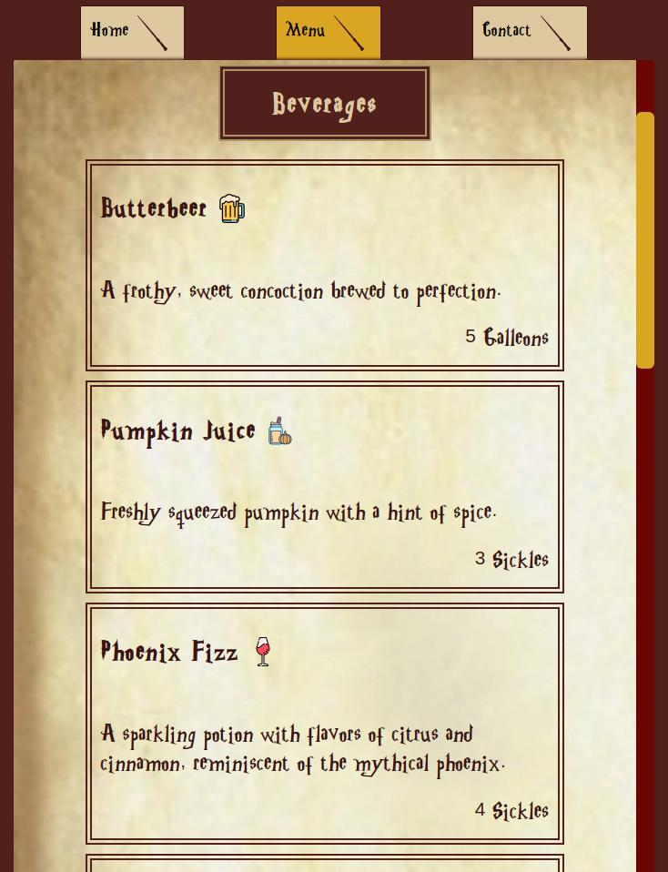

# The Three Broomsticks: A Harry Potter Inspired Restaurant Page

This is a web page project inspired by The Three Broomsticks, a fictional restaurant from the Harry Potter universe.

## Built With

   <!-- js -->
 
 <!-- html -->
  
 <!-- css -->
 
 <!-- Webpack -->
 

## Deployed on GitHub Pages
[Check out the live demo](https://maddily.github.io/restaurant-page/)

## Acknowledgments

* Design and theme inspired by The Three Broomsticks from the Harry Potter series.
* The Harry Potter Font is by <a href="https://www.fontspace.com/fontomen">Fontomen</a> on <a href="https://www.fontspace.com/">FontSpace</a>
* <a href="https://www.flaticon.com/free-icons/dish" title="dish icons">Icons and favicon created by Freepik - Flaticon</a>
